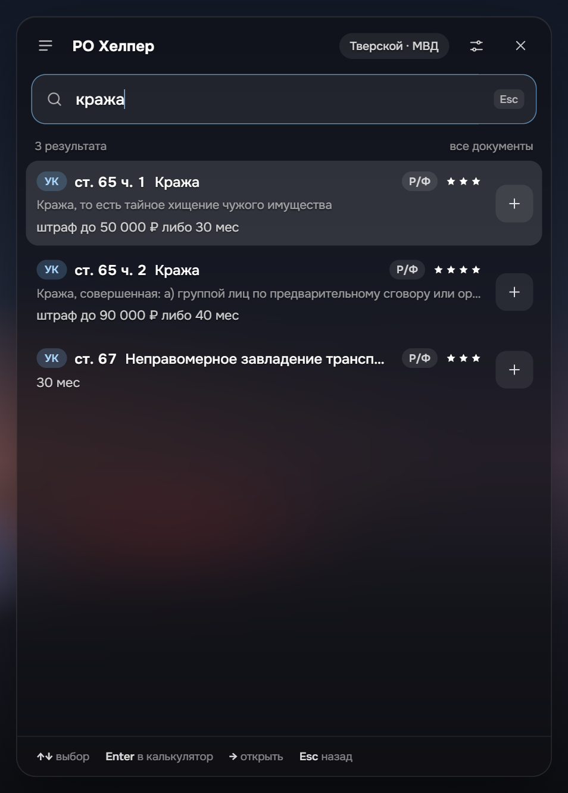
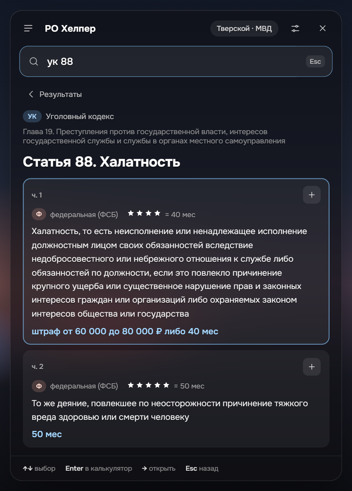
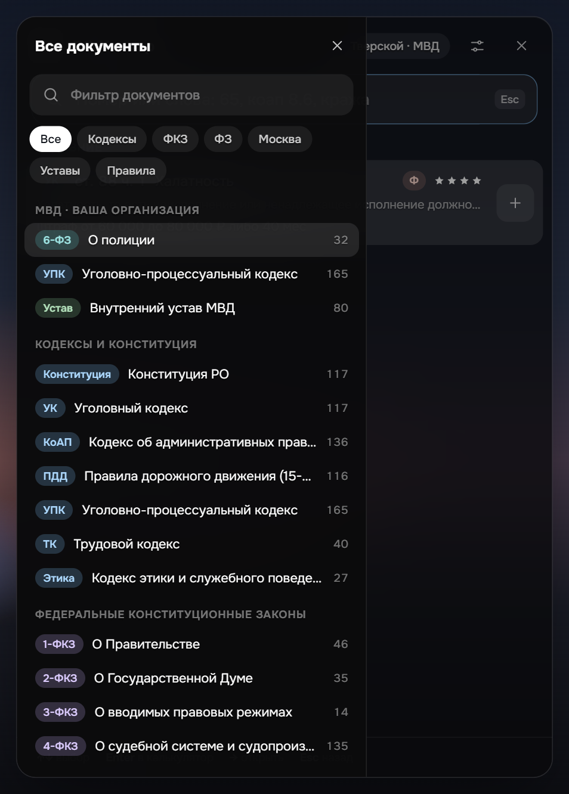
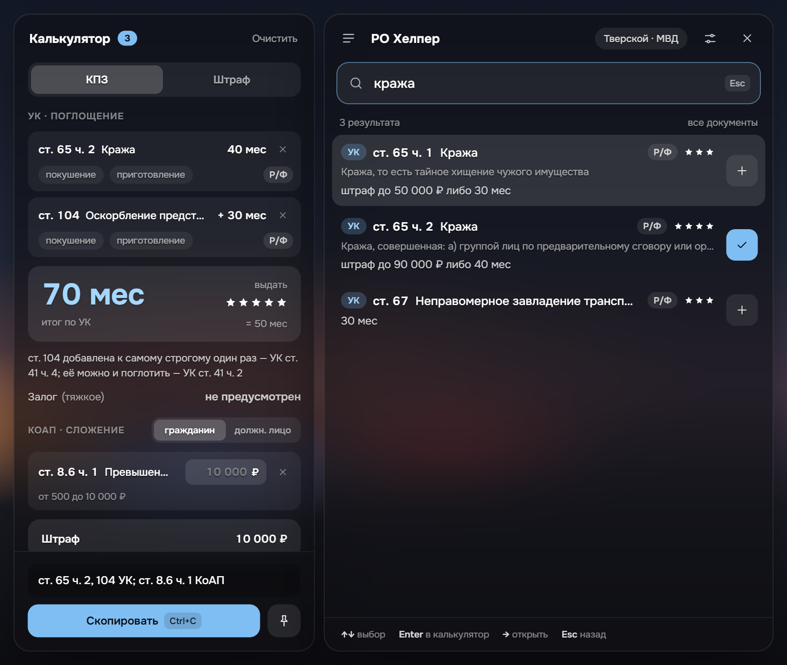

<div align="center">


# РО Хелпер

**Законы Russia Online поверх игры — по одной горячей клавише**

Поиск по законам сервера, калькулятор срока и штрафа, обвинение одной кнопкой

[**Скачать для Windows**](https://github.com/skyyyzeee/ro-helper/releases/latest) · [Discord](https://discord.gg/VBNn86EmDd)

</div>

<p align="center">
  
  
  
</p>

## Что умеет

- **Открывается поверх игры** по горячей клавише (по умолчанию <kbd>Alt</kbd>+<kbd>Q</kbd>) и прячется обратно, возвращая фокус игре. Курсор сразу в строке поиска.
- **Ищет как человек думает**: по номеру (`65`, `коап 8.6`, `ук 104 ч 2`), по словам и их формам, по жаргону (`ствол` → огнестрельное оружие) и с опечатками. Наказание, звёзды и подследственность видны прямо в результатах.
- **Три сервера**: Тверской (49 документов, включая уставы организаций и правила проекта), Арбатский (24) и Кутузовский (28). Конституция, УК, КоАП, ПДД, процессуальный и трудовой кодексы, ФКЗ и ФЗ. Документы вашей организации — первыми.
- **Калькулятор по закону своего сервера**: поглощение или сложение наказаний, потолки срока, покушение и приготовление, залог, сколько звёзд выдать, предупреждение о подследственности. Итог объясняется ссылками на статьи.
- **Обвинение в буфер** одной кнопкой или <kbd>Ctrl</kbd>+<kbd>C</kbd>: `ст. 65 ч. 2, 104 УК; ст. 8.6 ч. 1 КоАП`.
- **Закреплённая карточка** — статья или итог калькулятора остаются на экране поверх игры, а клики проходят сквозь неё.
- **Избранное и недавние**, оглавление каждого документа, регулируемая прозрачность.
- **«Что изменилось»** — после обновления законов программа один раз покажет правки, а изменённую статью можно открыть в виде «было → стало».
- **Работает без интернета**: законы встроены в программу. Интернет нужен только чтобы проверить обновления.

<p align="center">
  
</p>

## Установка

1. Скачайте `RO-Helper_…_x64-setup.exe` со страницы [последнего релиза](https://github.com/skyyyzeee/ro-helper/releases/latest).
2. Запустите. Права администратора не нужны: программа ставится только для вашей учётной записи.
3. Установщик без цифровой подписи, поэтому Windows может показать «Windows защитила ваш компьютер». Нажмите **Подробнее → Выполнить в любом случае**.
4. При первом запуске выберите сервер, организацию и горячую клавишу.
5. В настройках графики игры включите режим **«Оконный без рамки»** — в полноэкранном режиме Windows не даёт показывать окна поверх игры.

Нужна Windows 10 или 11. Иконка программы живёт в трее: там же «Показать / скрыть» и «Выход».

## Обновления

Программа сама проверяет обновления при запуске и раз в несколько часов. Когда выйдет новая версия, под заголовком оверлея появится предложение обновиться: «Обновить» скачает и поставит её, программа перезапустится сама; «Позже» отложит до следующей версии. Проверить вручную — в настройках, кнопка «Проверить обновления».

Обновления подписаны ключом проекта: программа не установит файл, который подписан не им.

Законы обновляются вместе с программой. Если правки на форуме вышли, а обновления ещё нет — напишите в [Discord](https://discord.gg/VBNn86EmDd).

## Горячие клавиши в оверлее

| Клавиша | Действие |
| --- | --- |
| <kbd>↑</kbd> <kbd>↓</kbd> | выбрать статью |
| <kbd>Enter</kbd> | добавить в калькулятор или убрать из него |
| <kbd>→</kbd> | открыть статью целиком |
| <kbd>Ctrl</kbd>+<kbd>C</kbd> | скопировать обвинение |
| <kbd>Esc</kbd> | шаг назад; на главном экране — скрыть оверлей |
| <kbd>Backspace</kbd> в пустом поиске | искать во всех документах, а не в одном |

## Безопасно ли это

РО Хелпер — обычное окно поверх игры. Он не читает и не изменяет память игры, не внедряется в её процесс и не нажимает клавиши за вас. Всё, что он делает с игрой, — возвращает ей фокус, когда вы прячете оверлей.

## Конфиденциальность

РО Хелпер не собирает данные: ни аккаунтов, ни аналитики, ни телеметрии. Настройки, избранное и недавние хранятся только на вашем компьютере. В интернет программа обращается лишь за обновлениями к GitHub — это можно выключить в настройках. Подробно — в [политике конфиденциальности](PRIVACY.md); она же открывается в программе: «Настройки» → «Политика конфиденциальности».

## Серверы

Поддерживаются **Тверской**, **Арбатский** и **Кутузовский**. Сервер выбирается при первом запуске и меняется в настройках; у каждого свои законы, свои организации и свои правила расчёта наказания.

## Для разработчиков

Tauri 2 (Rust) + React и TypeScript. Нужны [Node.js](https://nodejs.org/) 24, [Rust](https://rustup.rs/) и WebView2 (он есть в Windows 10/11).

```bash
npm install
npm run dev          # в браузере, без игры: http://127.0.0.1:1420
npm run tauri dev    # настоящий оверлей
npm test             # тесты
npm run import       # пересобрать законы из data/tverskoi/sources
```

- `src/core` — ядро: поиск, калькулятор, сравнение версий законов (чистый TypeScript)
- `src/importer` — разбор текстов законов с форума в `src/data/tverskoi.json`
- `src/ui` — интерфейс, `src/platform` — всё, что касается Windows и Tauri
- `src-tauri` — нативная часть: горячая клавиша, трей, окно закреплённой карточки, обновления

### Как выпустить версию

1. Поднять версию: `npm version 1.0.3 --no-git-tag-version` (меняет `package.json`, её же берёт Tauri), написать раздел `## 1.0.3` в [CHANGELOG.md](CHANGELOG.md) — это текст «Что нового» в релизе, — закоммитить и отправить.
2. Поставить на этот коммит тег с той же версией и отправить его: `git tag v1.0.3 && git push origin v1.0.3`. Если тег и версия в `package.json` не совпадут, сборка остановится.
3. GitHub Actions соберёт установщик, подпишет обновление и создаст черновик релиза с `latest.json` и «Что нового» из CHANGELOG.md.
4. Проверить черновик и опубликовать — после этого установленные программы предложат обновиться.

Для подписи в секретах репозитория нужны `TAURI_SIGNING_PRIVATE_KEY` (содержимое закрытого ключа) и `TAURI_SIGNING_PRIVATE_KEY_PASSWORD`. Открытый ключ записан в `src-tauri/tauri.conf.json`.

## Политика подписи кода / Code signing policy

Установщики собираются из исходного кода этого репозитория в GitHub Actions ([release.yml](.github/workflows/release.yml)) — ничего не собирается вручную на чужих компьютерах. Каждый релиз перед публикацией проверяет и утверждает автор.

Installers are built from the source code in this repository by GitHub Actions ([release.yml](.github/workflows/release.yml)); nothing is built by hand. Every release is reviewed and approved by the maintainer before it is signed and published.

Free code signing provided by [SignPath.io](https://about.signpath.io/), certificate by [SignPath Foundation](https://signpath.org/) — *applied for; until the application is approved, installers are not signed.*

- Committers and reviewers / Авторы и ревьюеры: [skyze](https://github.com/skyyyzeee)
- Approvers / Утверждают релизы: [skyze](https://github.com/skyyyzeee)

Privacy / Конфиденциальность: see the [privacy policy](PRIVACY.md). This program will not transfer any information to other networked systems unless specifically requested by the user or the person installing or operating it, except for the automatic update check against GitHub Releases described in the policy, which can be turned off in the settings.

## Автор

**skyze** — [GitHub](https://github.com/skyyyzeee) · [Discord](https://discord.gg/VBNn86EmDd)

Нашли ошибку в статье или в расчёте — пишите в Discord или создайте [issue](https://github.com/skyyyzeee/ro-helper/issues).

## Лицензия

Код — [MIT](LICENSE). Тексты законов, уставов и правил принадлежат проекту Russia Online и их авторам; лицензия MIT на них не распространяется.

РО Хелпер — неофициальная программа, она не связана с администрацией Russia Online.
