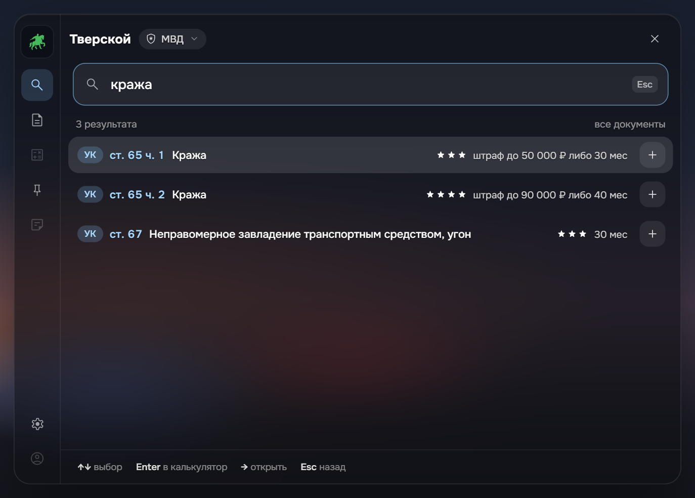
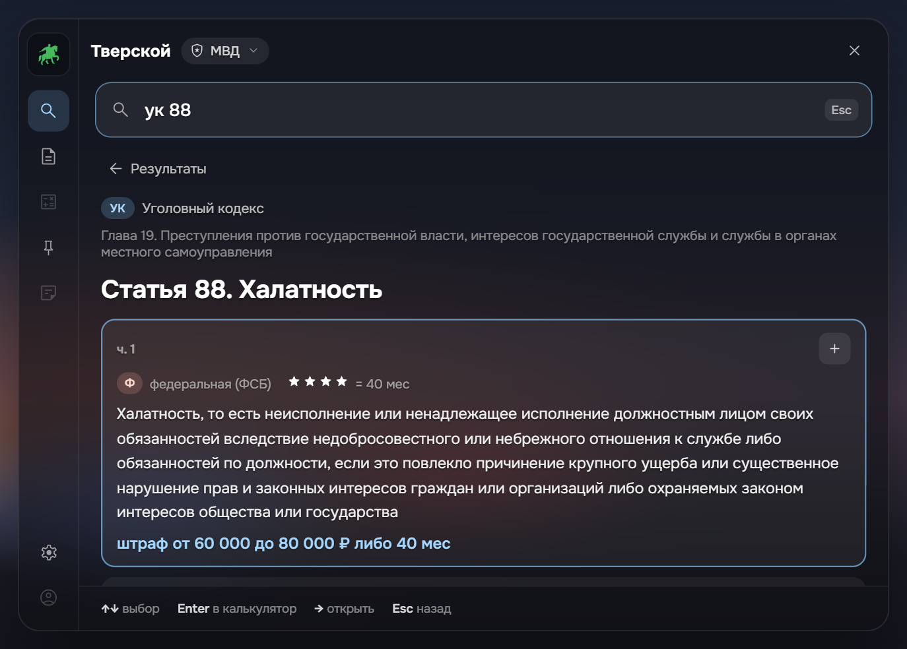
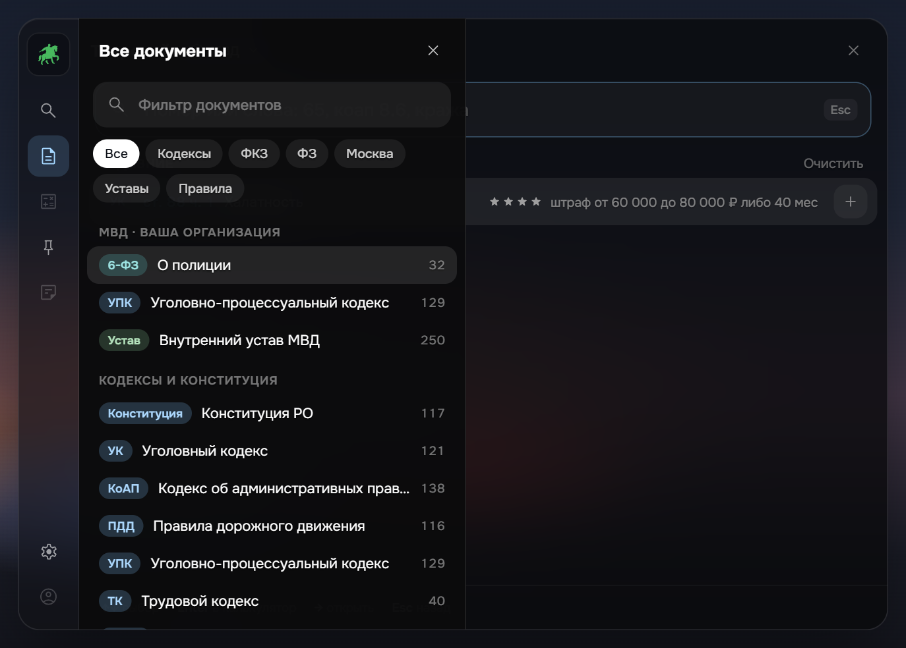
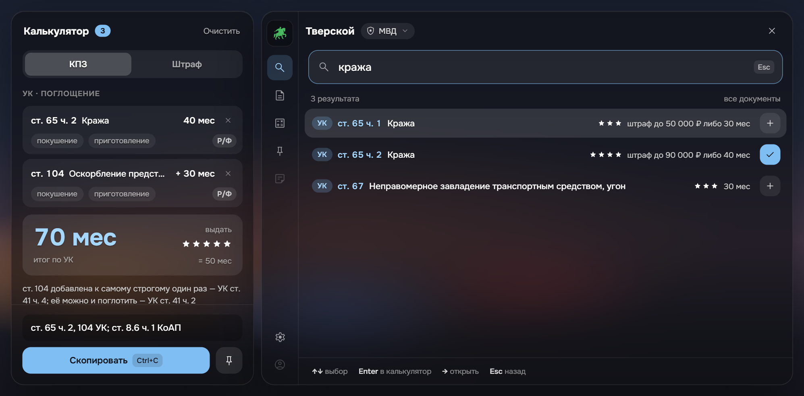

<div align="center">


# Кремлёвский Ассистент

<sub>раньше — РО Хелпер</sub>

**Законы Russia Online поверх игры — по одной горячей клавише**

Поиск по законам сервера, калькулятор срока и штрафа, обвинение одной кнопкой

[**Скачать для Windows**](https://github.com/skyyyzeee/ro-helper/releases/latest) · [Discord](https://discord.gg/VBNn86EmDd)

</div>

<p align="center">
  
  
  
</p>

## Что умеет

- **Открывается поверх игры** по горячей клавише (по умолчанию <kbd>Alt</kbd>+<kbd>Q</kbd>) и прячется обратно, возвращая фокус игре. Курсор сразу в строке поиска.
- **Ищет как человек думает**: по номеру (`65`, `коап 8.6`, `ук 104 ч 2`), по словам и их формам, по жаргону (`ствол` → огнестрельное оружие) и с опечатками. Наказание, звёзды и подследственность видны прямо в результатах, а наказание по правилам проекта и уставам — красным.
- **Три сервера**: Тверской (59 документов), Арбатский (54) и Кутузовский (51). Конституция, УК, КоАП, ПДД, процессуальный и трудовой кодексы, ФКЗ и ФЗ, уставы и положения организаций, все общие правила проекта. Документы вашей организации — первыми.
- **Калькулятор по закону своего сервера**: поглощение или сложение наказаний, потолки срока, покушение и приготовление, залог, сколько звёзд выдать, предупреждение о подследственности. Итог объясняется ссылками на статьи.
- **«Отдел»** — для своей организации: «Как это делается по закону» (задержание, права задержанного, обыск, применение силы, машина, допрос, освобождение, штрафы, сроки — статьи своего сервера по теме) и устав коротко: звания, кто над вами, обращение к старшему, рабочее время, взыскания — у каждой строки ссылка на пункт устава.
- **Обвинение в буфер** одной кнопкой или <kbd>Ctrl</kbd>+<kbd>C</kbd>: `ст. 65 ч. 2, 104 УК; ст. 8.6 ч. 1 КоАП`.
- **Закреплённые карточки** — статьи и итог калькулятора остаются на экране поверх игры, а клики проходят сквозь них. Карточек может быть сколько угодно: каждая перетаскивается за свою шапку и растягивается за уголок, а если перетащить одну на другую — они соединяются в блок с той стороны, куда бросили: снизу, сверху или в ряд. Блок можно листать по одной карточке или свернуть в компактный вид, а набор закреплённых — сохранить и вернуть одной кнопкой. Закреплённые статьи возвращаются после перезапуска.
- **Избранное и недавние**, оглавление каждого документа, регулируемая прозрачность.
- **«Что изменилось»** — после обновления законов программа один раз покажет правки, а изменённую статью можно открыть в виде «было → стало».
- **Законы обновляются сами**: правки с форума приходят с GitHub без новой версии программы, а после обновления программы видно, что нового во всех пропущенных версиях.
- **Работает без интернета**: законы встроены в программу. Интернет нужен только чтобы проверить обновления.

<p align="center">
  
</p>

## Установка

1. Скачайте `RO-Helper_…_x64-setup.exe` со страницы [последнего релиза](https://github.com/skyyyzeee/ro-helper/releases/latest).
2. Запустите. Права администратора не нужны: программа ставится только для вашей учётной записи.
3. Установщик без цифровой подписи, поэтому Windows может показать «Windows защитила ваш компьютер». Нажмите **Подробнее → Выполнить в любом случае**.
4. При первом запуске выберите сервер, организацию и горячую клавишу.
5. В настройках игры включите **«Оконный без рамки»** («Графика» → «Тип экрана») — в полноэкранном режиме Windows не даёт показывать окна поверх игры — и выключите **«Отключение звука при потере фокуса»** («Аудио»), иначе игра глушит звук, пока открыт ассистент.

Нужна Windows 10 или 11. Иконка программы живёт в трее: там же «Показать / скрыть» и «Выход».

## Обновления

Программа сама проверяет обновления при запуске и раз в несколько часов. Когда выйдет новая версия, в правом верхнем углу экрана на несколько секунд появится уведомление (его видно и поверх игры), а под заголовком оверлея — предложение обновиться: «Обновить» скачает и поставит её, программа перезапустится сама; «Позже» отложит до следующей версии. Проверить вручную — в настройках, кнопка «Проверить обновления».

Обновления подписаны ключом проекта: программа не установит файл, который подписан не им.

Законы обновляются вместе с программой. Если правки на форуме вышли, а обновления ещё нет — напишите в [Discord](https://discord.gg/VBNn86EmDd).

## Горячие клавиши в оверлее

| Клавиша | Действие |
| --- | --- |
| <kbd>↑</kbd> <kbd>↓</kbd> | выбрать статью |
| <kbd>Enter</kbd> | добавить в калькулятор или убрать из него |
| <kbd>→</kbd> | открыть статью целиком |
| <kbd>Ctrl</kbd>+<kbd>C</kbd> | скопировать обвинение |
| <kbd>Esc</kbd> | шаг назад; на главном экране — скрыть оверлей |
| <kbd>Backspace</kbd> в пустом поиске | искать во всех документах, а не в одном |

## Безопасно ли это

Кремлёвский Ассистент — обычное окно поверх игры. Он не читает и не изменяет память игры, не внедряется в её процесс и не нажимает клавиши за вас. Всё, что он делает с игрой, — возвращает ей фокус, когда вы прячете оверлей.

## Конфиденциальность

Картинки в разделе «Вики» загружаются с сервера картинок вики (Majestic), только когда вы открываете этот раздел, — он видит ваш интернет-адрес, как любой сайт. Оценки ответов ИИ (👍 / 👎 / «Исправить») уходят на сервер ИИ, только когда вы их нажмёте, и хранятся без номера компьютера и аккаунта. Без входа в аккаунт Кремлёвский Ассистент не собирает данные о вас: автору уходят только обезличенные счётчики за день (сколько открыто статей, поисков и расчётов на каждом сервере), и их можно выключить в настройках. Настройки, избранное, недавние и ваши заготовки для чата хранятся только на вашем компьютере; заготовка по нажатию попадает в буфер обмена — в игру программа ничего не печатает. В интернет программа обращается за обновлениями к GitHub — это можно выключить в настройках. Вход через Discord или Telegram — по желанию: тогда ваши имя, аватар и почта из Discord (или имя и ник из Telegram) хранятся в аккаунте на Supabase, а ваша карточка — имя, игровой ник, должность, сервер и фракция — видна администратору, чтобы выдавать роли лидеров. Подробно — в [политике конфиденциальности](PRIVACY.md); она же открывается в программе: «Настройки» → «Политика конфиденциальности».

## Серверы

Поддерживаются **Тверской**, **Арбатский** и **Кутузовский**. Сервер выбирается при первом запуске и меняется в настройках; у каждого свои законы, свои организации и свои правила расчёта наказания.

## Для разработчиков

Tauri 2 (Rust) + React и TypeScript. Нужны [Node.js](https://nodejs.org/) 24, [Rust](https://rustup.rs/) и WebView2 (он есть в Windows 10/11).

```bash
npm install
npm run dev          # в браузере, без игры: http://127.0.0.1:1420
npm run tauri dev    # настоящий оверлей
npm test             # тесты
npm run import       # пересобрать законы из data/tverskoi/sources
npm run laws:check   # какие законы изменились на форуме — и их новые тексты
```

**Проверить законы на форуме** (`npm run laws:check`). Откройте http://127.0.0.1:8788/check:
1. Один раз перетащите кнопку «Проверить законы» в закладки.
2. Нажмите «Перейти на форум».
3. На форуме нажмите закладку.

За 2–3 минуты обходятся все темы с законами. Сравнивается сам текст, а не дата: форум показывает правку не всегда. Новые тексты изменившихся документов сохраняются в `data/<сервер>/sources`. Сомнительные — черновик «проект редакции», не тот пост, тема не найдена — не сохраняются, а перечисляются для ручной проверки. Дальше как обычно: `npm run import`, тесты, `npm run charters:check`.

- `src/core` — ядро: поиск, калькулятор, сравнение версий законов (чистый TypeScript)
- `src/importer` — разбор текстов законов с форума в `src/data/tverskoi.json`
- `src/ui` — интерфейс, `src/platform` — всё, что касается Windows и Tauri
- `src-tauri` — нативная часть: горячая клавиша, трей, окно закреплённых карточек, обновления

### Как выпустить версию

1. Поднять версию: `npm version 1.0.3 --no-git-tag-version` (меняет `package.json`, её же берёт Tauri), написать раздел `## 1.0.3` в [CHANGELOG.md](CHANGELOG.md) — это текст «Что нового» в релизе, — закоммитить и отправить.
2. Поставить на этот коммит тег с той же версией и отправить его: `git tag v1.0.3 && git push origin v1.0.3`. Если тег и версия в `package.json` не совпадут, сборка остановится.
3. GitHub Actions соберёт установщик, подпишет обновление и создаст черновик релиза с `latest.json` и «Что нового» из CHANGELOG.md.
4. Проверить черновик и опубликовать — после этого установленные программы предложат обновиться.

Для подписи в секретах репозитория нужны `TAURI_SIGNING_PRIVATE_KEY` (содержимое закрытого ключа) и `TAURI_SIGNING_PRIVATE_KEY_PASSWORD`. Открытый ключ записан в `src-tauri/tauri.conf.json`.

## Политика подписи кода / Code signing policy

Установщики собираются из исходного кода этого репозитория в GitHub Actions ([release.yml](.github/workflows/release.yml)) — ничего не собирается вручную на чужих компьютерах. Каждый релиз перед публикацией проверяет и утверждает автор.

Installers are built from the source code in this repository by GitHub Actions ([release.yml](.github/workflows/release.yml)); nothing is built by hand. Every release is reviewed and approved by the maintainer before it is signed and published.

Free code signing provided by [SignPath.io](https://about.signpath.io/), certificate by [SignPath Foundation](https://signpath.org/) — *applied for; until the application is approved, installers are not signed.*

- Committers and reviewers / Авторы и ревьюеры: [skyze](https://github.com/skyyyzeee), [AidenArokij](https://github.com/AidenArokij)
- Approvers / Утверждают релизы: [skyze](https://github.com/skyyyzeee)

Privacy / Конфиденциальность: see the [privacy policy](PRIVACY.md). This program will not transfer any information to other networked systems unless specifically requested by the user or the person installing or operating it, except for the automatic update check against GitHub Releases described in the policy, which can be turned off in the settings, the anonymous daily usage counts described in the policy, which can be turned off in the settings, and the optional sign-in with Discord or Telegram through Supabase, which happens only when the user asks for it.

## Авторы

**skyze** — [GitHub](https://github.com/skyyyzeee) · [Discord](https://discord.gg/VBNn86EmDd)

**AidenArokij** — ИИ-помощник и его сервер · [GitHub](https://github.com/AidenArokij)

Нашли ошибку в статье или в расчёте — пишите в Discord или создайте [issue](https://github.com/skyyyzeee/ro-helper/issues).

## Лицензия и права

Код программы — [MIT](LICENSE). Лицензия MIT относится только к коду.

**Все права на материалы Russia Online принадлежат Russia Online.** Тексты законов, уставов и правил серверов, данные вики (названия, описания, цены, характеристики), изображения, значки и названия серверов и организаций — собственность проекта Russia Online и их авторов. Программа не присваивает эти материалы; лицензия MIT на них не распространяется, и права использовать их дальше программа никому не даёт.

**Только то, что опубликовано открыто.** В программу попадает лишь то, что Russia Online сама публикует для всех: темы форума с законами и правилами и страницы вики `wiki.russia.online`. Программа не использует закрытую, служебную или секретную информацию, не обходит защиту сайтов и ограничения доступа и не обращается к игре, её файлам и серверам. У каждого документа и на каждой странице вики указан источник со ссылкой; картинки вики в программу не копируются — они загружаются с сервера картинок вики.

**Добровольно и бесплатно.** Кремлёвский Ассистент делают игроки по собственной инициативе, в свободное время. Он бесплатный, без рекламы и платных функций, и нужен для одного — чтобы игрокам было удобнее пользоваться тем, что уже опубликовано.

**Неофициальная программа.** Её выпускает не Russia Online, и администрация проекта не отвечает за её работу. Законы и правила меняются: если текст в программе расходится с форумом или вики, верен первоисточник.

**Правообладателям.** Если вы представляете Russia Online и хотите, чтобы какой-то материал изменили или убрали из программы, напишите авторам — в Discord или [issue](https://github.com/skyyyzeee/ro-helper/issues), — и это будет сделано.

Иконки — [Material Symbols](https://fonts.google.com/icons) от Google, лицензия [Apache 2.0](https://www.apache.org/licenses/LICENSE-2.0); они встроены в программу (`src/ui/symbols.ts`, собираются `node scripts/icons.mjs`). Значки и цвета серверов — с [вики Russia Online](https://wiki.russia.online/ru/servers).


